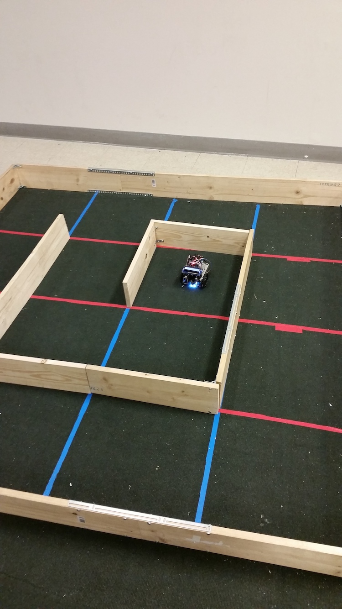

# Maze Explorer

Description
--------
This program uses Arduino to make a robot navigate an unknown maze and then find the shortest path from an arbitrary start point to a determined end location.

